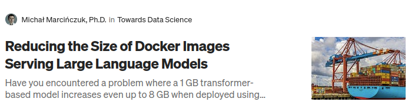
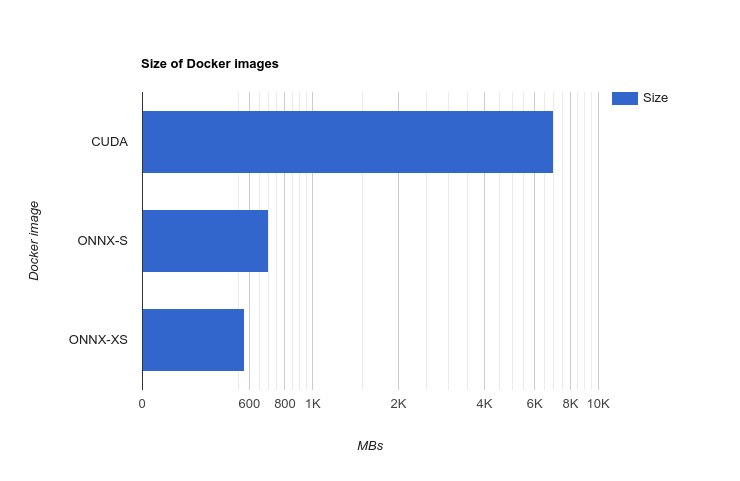

# Introduction

This repository demonstrates how to create a small Docker image serving large language models (LLMs).

The resources present in this repo were used in the Medium articles.

https://medium.com/towards-data-science/reducing-the-size-of-docker-images-serving-llm-models-b70ee66e5a76

 # TL;DR

It is possible to reduce the size of the Docker image serving an LLM model from gigabytes to megabytes. 
In our case, it was **from 7GB to 575MB**. Such a significant size reduction might be useful when we are limited or
stumble by network transfers (pushing and pulling the image over a network), the image registry's limitations,
or the production server's memory limitations.

Size reduction was possible thanks to:

- using `onnxruntime` instead of `torch`,
- converting and quantizing the model to ONNX format,
- model compression,
- using `tokenizers` package instead of `transformers`.

